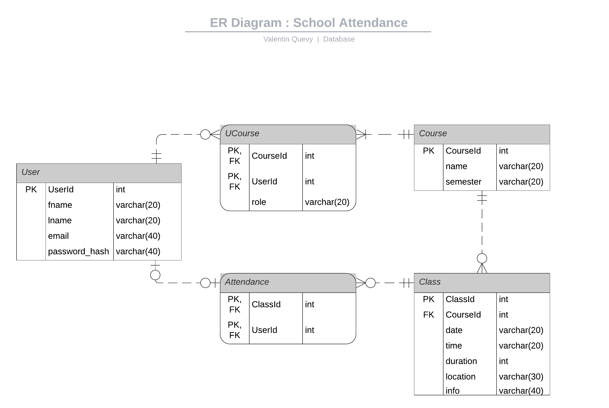
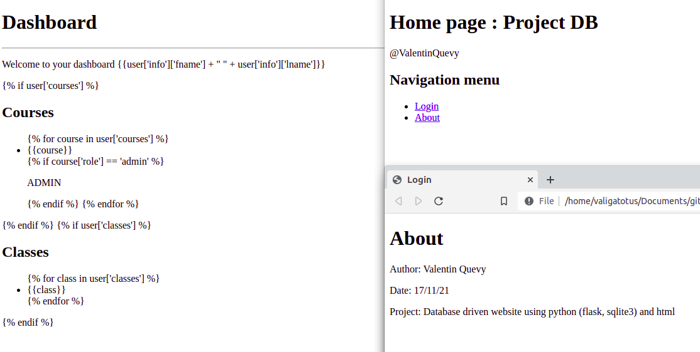
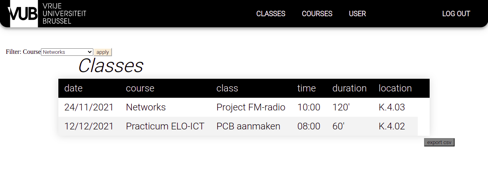
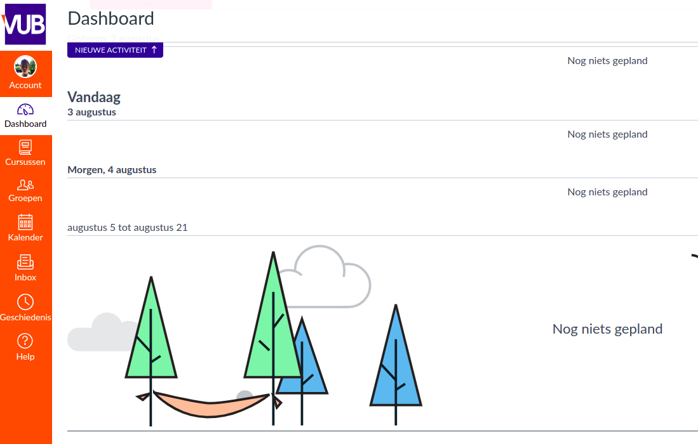
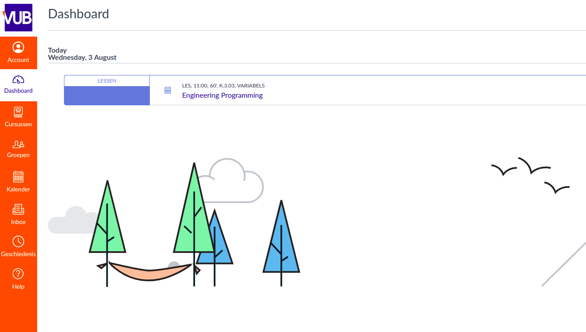

# Database Management: Project
Author: valigatotuS  
Created: 09/12/2021

  
Table of Contents

  <ol>
    <li>
      <a href="#about-this-project">About This Project</a>
      <ul>
        <li><a href="#context">Context</a></li>
        <li><a href="#built-with">Built With</a></li>
        <li><a href="#roadmap">Roadmap</a></li>
        <li><a href="#folder-structure">Folder structure</a></li>
      </ul>
    </li>
    <li>
      <a href="#web-app">Web-app</a>
      <ul>
        <li><a href="#database">Database</a></li>
        <li><a href="#front-end">Front-end</a></li>
        <li><a href="#rest-api">REST API</a></li>
      </ul>
    </li>
    <a href="#deploy-project">Deploy project</a>
    <li>
        <a href="#credits">Credits</a>
        <ul>
            <li><a href="#sources">Sources</a></li>
        </ul>
    </li>
  </ol>

## About this project

### Context
The purpose of this project is to learn developping simple 
database driven web-sites.

### Built with
* python [flask, sqlalchemy, jinja]
* SQL
* html
* css
* javascript (little)

### Description
The website must serve to log the attendances at school. 
The users involved are: students, teachers & administrators.

### Requirements
- Users  are e.g. students who log in and join classes
- Teachers can organize classes for a course 
- Administartors can create new courses and assign teachers and users to
these courses

### Roadmap
Building this project went through several stages...

- [x] Understand app requirements
- [x] Database design 
- [x] Front-end design
- [x] REST-API design
- [x] Website testing
- [x] Write API-documentation
- [ ] Review project

### Folder Structure
    src
    ├── app
    │   ├── blueprints          => sub-apps (each contains routes, forms, static-files, templates)
    │   ├── database            => database & management    (db, queries, models:tables)
    │   ├── __init__.py         => app initialiser
    │   ├── static              => global static assets (css, js, img)
    │   └── templates           => global templates (html, jinja)
    ├── config.py               => app configuration file
    ├── Makefile                => script automating app launching and cleaning via console
    └── run.py                  => app run-file

## Web-app

### Database
Following picture represent the Entity Relationship Diagram, describing the design of my database. 
The entities are: User, UCourse, Course, Class and Attendance.  

We are using the python module "SQLAlchemy" for the database managament part of this project 
SQLAlchemy is great for quick designing the entities and querying the tables safely, however I also tried SQL-like based queries to get a grasp of it 
The database will be stored in an sqlite-file. 

### Front end
For the front-end of the website I designed multiples templates but I was never convinced of the result.
I decided to recreate our University web-site with the requirements add-ons in order to get a good grasp of how 
html & css works.
 
 
 

 
The two first images represent my early prototypes of the website. 
The third one represent ours University dashboard. 
The last one is my recreation of it. 

### REST API
<i>REST APIs communicate via HTTP requests to perform standard database functions like creating, reading, updating, and deleting records (also known as CRUD) within a resource. For example, a REST API would use a GET request to retrieve a record, a POST request to create one, a PUT request to update a record, and a DELETE request to delete one.</i>

<a href='API-docu.md'>API-documentation</a>

## Deploy project

1. Clone this project
      <code> git clone ... </code>
2. Go to src/ directory 
      <code> cd src/ </code>
2. Install the needed requirements
3. Run the app
      <code> $ make run </code>
 

Have fun on my website!

## Credits
This project is part of the course "Database Management" at the VUB for 3BA Industrial Sciences ELO-ICT students given by the instructors Ann Braeken & Tom Godden.
### Sources

